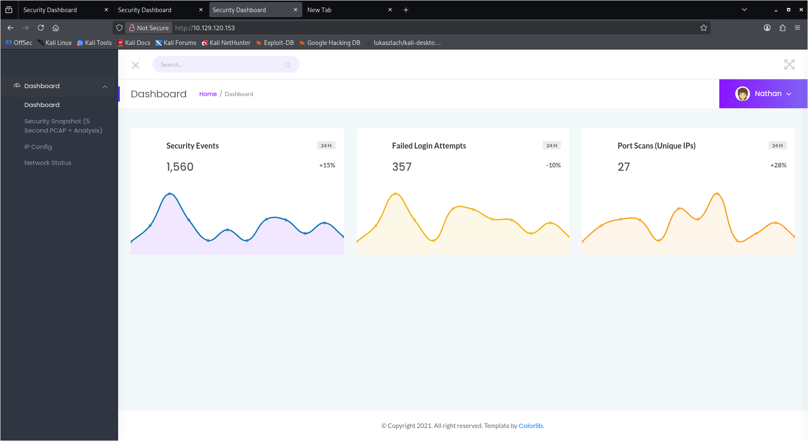

# Cap — Easy (Linux)

**Category:** IDOR → credential leak via packet capture → Linux capability misconfiguration
**Summary:** A web app leaks a downloadable traffic capture to any user via an IDOR, which contains a plaintext SSH password. From there, privilege escalation comes from a misconfigured Linux capability on the Python binary.

## Recon
```
# nmap -sC -sV <target-ip>

PORT STATE SERVICE
21/tcp open ftp
22/tcp open ssh
80/tcp open http
```


## Enumeration
- Browsed the web app on port 80 and explored its functionality rather than just the homepage.
- Noticed the app referenced numbered resources (e.g. a capture ID in the URL) and tested changing that number — this is an **IDOR** (Insecure Direct Object Reference): the app trusted the ID in the URL instead of checking whether I was allowed to access that specific resource.
- By changing the ID, I could access other users' data, including a `.pcap` (packet capture) file that wasn't meant to be mine.

## Exploitation
- Downloaded the `.pcap` file and opened it in Wireshark to inspect the captured traffic.
- Filtered the traffic and found a plaintext password sent in the clear — meaning some service on the box wasn't using encryption.
- Used the recovered credentials to log in via SSH as the user `nathan`, giving me an initial foothold.

## Privilege Escalation
- Downloaded `linpeas.sh` to my attacking machine and served it with a local Python HTTP server, then pulled and ran it from the target over the foothold shell to look for common misconfigurations.
- linpeas flagged a file with the `cap_setuid+ep` **Linux capability** set on the Python binary — meaning any user able to run that Python binary could change their own UID, effectively becoming any user, including root.
- Exploited this directly:
  This set my UID to 0 (root) before spawning a shell, giving me a root shell.
- Verified with `id` / `whoami`, then read the root flag.

## Flag
Captured both the user flag (via SSH as `nathan`) and the root flag (via the capability exploit) — not reproducing either value here.

## Defensive takeaway
- The root cause was over-privileging a general-purpose interpreter: Python didn't need the ability to change UIDs, it just needed raw packet access for capturing traffic. The fix is applying least privilege — granting `cap_net_raw` instead of `cap_setuid`, or better, having the web app delegate packet capture to a small, purpose-built, tightly scoped service rather than invoking a general scripting language with elevated capabilities at all.

## Lessons learned
- IDORs are easy to miss because the app "works fine" for your own data — the bug only shows up when you deliberately try IDs that aren't yours.
- Traffic captures often contain secrets in the clear; always worth checking for leaked `.pcap`/log files on a target.
- Linux capabilities are a subtler privesc vector than SUID binaries but just as dangerous — `getcap -r / 2>/dev/null` is worth running on every box.