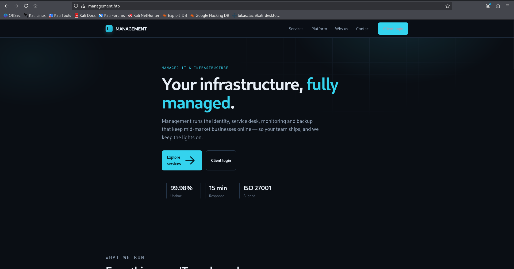
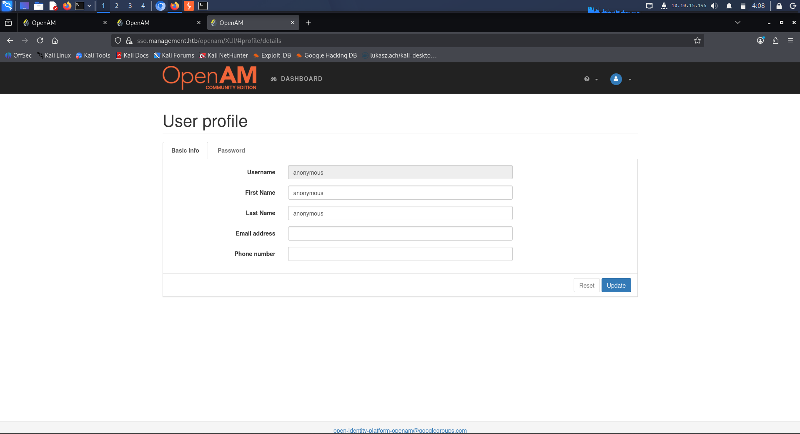

# Management — Medium (Linux)

**Category:** Virtual host discovery → auth bypass → pre-auth RCE (CVE-2026-33439) → credential/key theft → sudo argument injection
**Summary:** A multi-stage box built around a corporate SSO portal. Getting in required spotting a name-based virtual host, bypassing auth via manipulated headers, and chaining a known RCE. Escalation involved digging through a second web app's config, decrypting a stored secret using the target's own crypto library, and finally abusing a loosely-restricted sudo rule.

## Recon
```
nmap -sC -sV -p- <target-ip>

PORT STATE SERVICE VERSION
22/tcp open ssh OpenSSH
80/tcp open http nginx (redirects to https)
443/tcp open ssl/http nginx
```

The SSL certificate on port 443 revealed the real hostname (`management.htb`) and a wildcard subdomain — a sign this server uses **name-based virtual hosting** and won't serve anything sensible until you hit it with the right `Host` header.

## Enumeration
- Added `management.htb` (and the subdomain I later found referenced) to my local `/etc/hosts` pointing at the target IP.
- Browsing the site led to a corporate landing page, and from there to a login page for a single sign-on portal on a subdomain.



- Intercepted the login request in Burp Suite and noticed the app was passing authentication state through custom HTTP headers rather than a session cookie — meaning the client could just assert who it was.

- Poking around the app's loaded JavaScript revealed the exact SSO software and version in a file path/query string.

## Exploitation
- With the version identified, I searched for known vulnerabilities and found a public pre-authentication RCE affecting that exact version (deserialization of an unvalidated session parameter).
- Used a public proof-of-concept exploit for that CVE to confirm command execution, then used it to run enumeration commands directly on the box (starting with a low-privileged service account).
- Rather than guessing filenames, searched the filesystem by *content* (grepping for strings like `dbuser`/`dbpassword`) to locate a second web application's database config file, which led to a separate IT asset management app with its own DB credentials in plaintext.



- That second app stored some sensitive fields encrypted at rest using a modern authenticated encryption scheme, with the decryption key sitting on disk. Rather than trying to crack anything offline, I used my existing command execution to have the target's own PHP/crypto library decrypt the stored value for me — since if the app can decrypt it, so can anyone with the same file access.
- The decrypted value turned out to be a valid password for a real system user, which I used to SSH in directly and read the user flag.

## Privilege Escalation
- `sudo -l` showed a very specific but exploitable sudo rule: a backup utility restricted to one directory, but with a trailing wildcard allowing extra arguments to be appended to the command.
- That wildcard allowed injecting an extra option that redirected the "restricted" backup target to `/root` instead of the intended folder — a classic **argument injection** via an overly permissive sudo rule.
- Running the crafted command mirrored the entire root home directory to a location I could read, giving me the root flag and (optionally) the root SSH key for a clean root login.

## Flag
Captured both user and root flags via the chain above — not reproducing either value, the decrypted password, or the private key here.

## Lessons learned
- Never trust what the login *form* shows you — the real authentication logic was in raw HTTP headers, only visible by intercepting traffic.
- Searching for known content (`grep` for `dbuser`, `dbpassword`, etc.) across a filesystem is far more reliable than guessing config filenames.
- If an app can decrypt its own secrets, RCE on that app means you effectively can too — no need to attack the cryptography itself.
- A trailing wildcard (`*`) at the end of a sudo rule can completely undo a `--restrict-path`-style safeguard; sudo rules need to constrain *all* arguments, not just the command name.