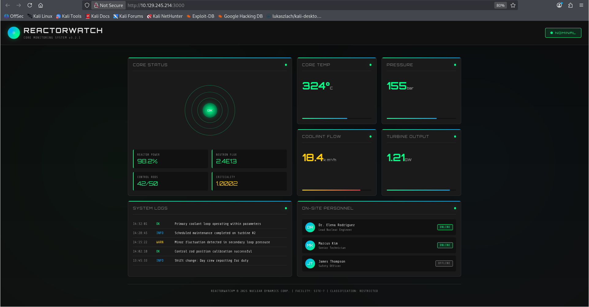

# Reactor — Easy (Linux)

**Category:** Web app RCE (Next.js) → credential reuse → Node.js debugger privilege escalation
**Summary:** A multi-stage box: exploit a vulnerable Next.js web app for an initial shell, extract and crack credentials from a local database, then escalate to root through an exposed Node.js debug port.

## Recon
```
# nmap -sC -sV <target-ip>

PORT STATE SERVICE
22/tcp open ssh
3000/tcp open http (Next.js app)
```

SSH was open but not an obvious entry point, so I focused on the web service on port 3000.

## Enumeration
- Visited the app in the browser and checked the page source and HTTP response headers (`curl -I`) to fingerprint the tech stack — confirmed it was a Next.js application, with the app calling itself "ReactorWatch."
- Searched for known public exploits against Next.js / the specific app name and found a proof-of-concept RCE script for a Next.js vulnerability.

## Exploitation
- Ran the public PoC against the target to confirm command execution (tested with `whoami`, got back `node`, confirming code execution as the `node` user).
- Set up a Netcat listener on my own machine, then used the same exploit to execute a base64-encoded reverse shell payload pointing back at my listener, landing an interactive shell as `node`.
- Once in, checked `/home` for users and looked around the app's working directory, where I found a SQLite database (`reactor.db`).
- Dumped the `users` table and found stored password hashes for an `admin` and an `engineer` account.
- Cracked the `engineer` hash offline with John the Ripper against the rockyou wordlist, then SSH'd in as `engineer` with the recovered password and read the user flag.

## Privilege Escalation
- Standard privesc checks (`sudo -l`, SUID binaries, cron jobs) didn't turn up much, so I checked running processes and found a Node.js process running **as root** with the `--inspect` debug flag enabled, bound to localhost.
- Since the debug port was only listening locally, I set up an SSH local port-forward from my machine to the target's debug port.
- With the port forwarded, I opened Chrome's DevTools remote inspector (`chrome://inspect`), connected to the forwarded debug target, and used the console to execute a command as root and read the root flag — since the Node debugger gives full JS execution in the context of the process it's attached to.

## Flag
Captured both the user flag (via SSH as `engineer`) and the root flag (via the Node.js inspector console) — not reproducing either value here.

## Lessons learned
- A debug flag left enabled in production (`--inspect`) on a process running as root is a critical privesc path — the debugger effectively grants arbitrary code execution in that process's context.
- Credential reuse and weak hashing (unsalted MD5) turned an initial low-privilege foothold into a full user account almost immediately.
- Always fingerprint unfamiliar web apps (headers, page source, framework name) before assuming there's no public exploit available.